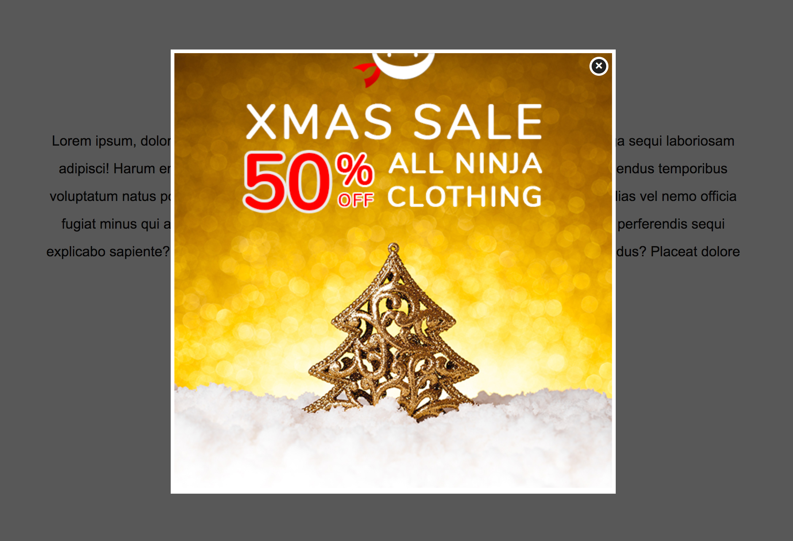

# [CSS Tips & Tricks #5 - CSS-Only Popup](https://www.youtube.com/watch?v=6Xfkr9n3LSA)

In this tutorial, we will build a popup using CSS only, no JavaScript.

[View demo site here.](https://webdevtuts.github.io/css_only_popup/)

